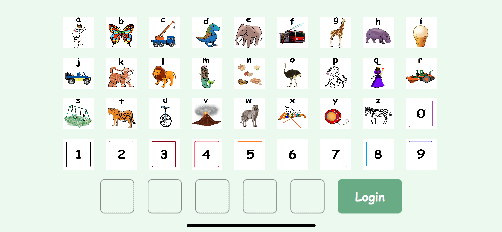
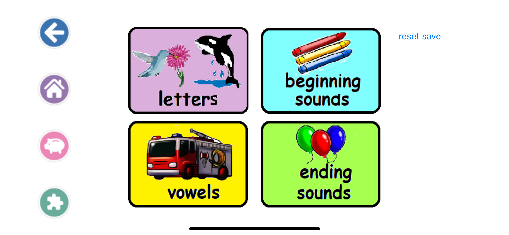
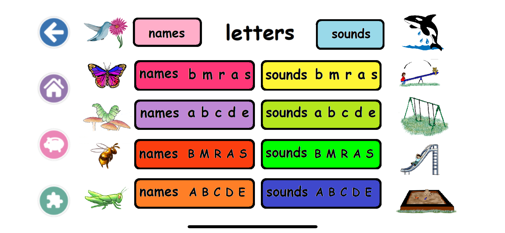
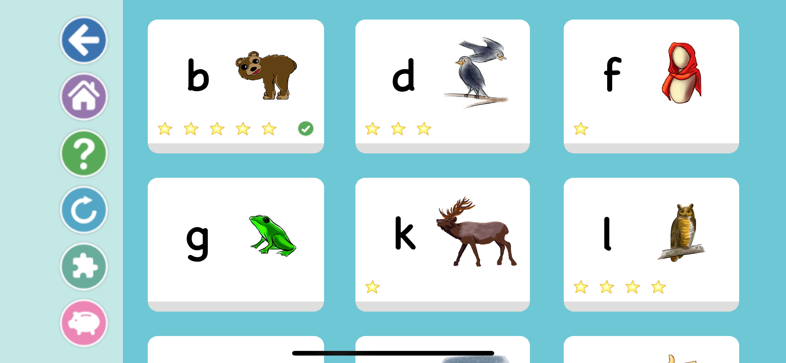
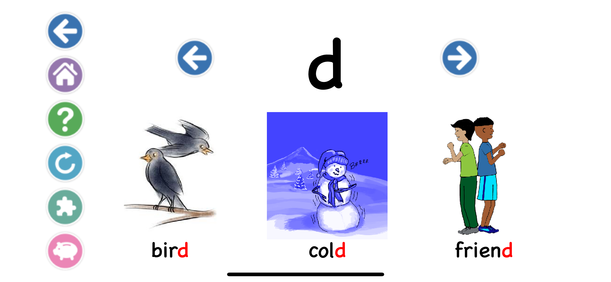
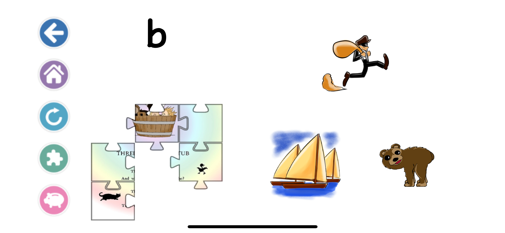
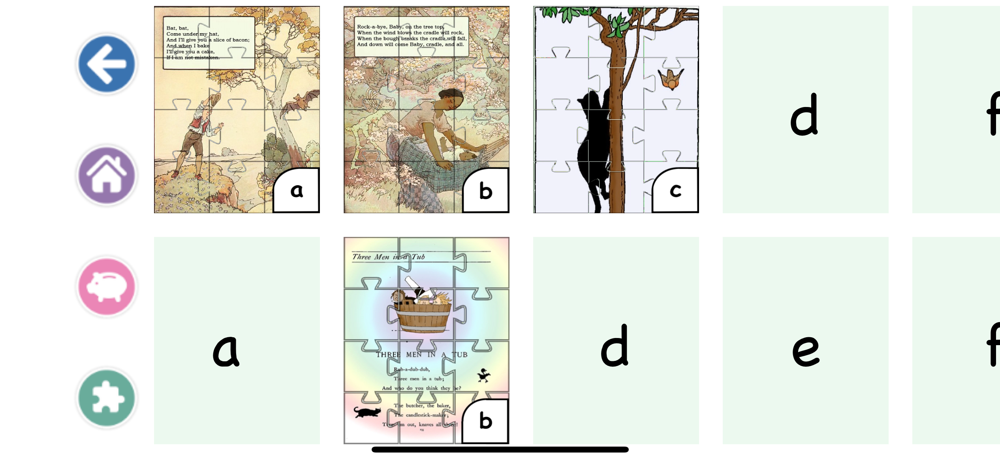
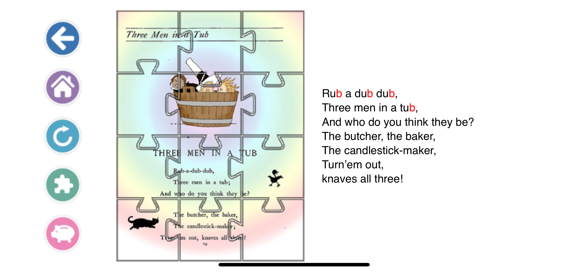
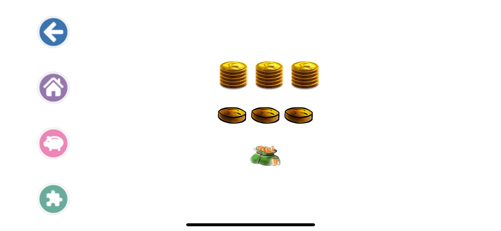

# KindergartenLiteracy (iOS)
Kindergarten Literacy App (iOS) - by Georgia Tech Junior Design TEAM 0352

An iOS app that allows Kindergarten kids to learn English by practicing and doing quizzes.

Project Owner [Hearatale.com](http://hearatale.com/)

Web app [Brainy Phonics](https://brainy-phonics.hearatale.com/)

Version 1.0.0

## Release Notes
### Version 1.0 software features
Student login using a five-digit code. (Preset code: ccccc)

Main page for four sections of this app.

Page to select letter subsections.

Level selection page for each section, progress is shown on the level buttons for each learning objectives.

Learning page for the letter / sound, with 3 example words.

Quiz page for students to take quiz. Correctly answering a quiz will earn puzzles, stars, coins etc.

Puzzle page for students to check their completed puzzles.

Rhyme page for each puzzle students collected.

Coin page for students to check coins they earned.

### Known bugs and defects
- Student progression is now not reported to DAP since this version have not been deployed for actual use.
- If the developer changes the progression save file, they have to click the "reset save" button on the main screen to avoid crashing. (the reset save button is purposefully left in for debugging use, if no longer needed, the developer can simply delete it from the storyboard file.)
- A couple of letters not being able to change to red.
- A very small amount of rhymes and puzzles have missing pieces / sound file, due to the file also missing from the given assets / web app.

## Install Guide 
### Pre-requisites:
Requires a desktop device running MacOS. (Macbook, Macmini, iMac etc.)
Download and install Xcode. See https://developer.apple.com/xcode/resources/

### Download instructions: 
**Obtain the Project Files (Using Version Control)**
1. Go to the main page of this repository.
2. Click on the green download file button on the top right corner of all files.
3. Under "Clone with HTTPS", copy the URL.
4. Open terminal on Mac.
5. Navigate to the directory you want the project be.
6. Type git clone, then paste the URL you copied earlier. Example: git clone https://github.com/TigerSHe1998/KindergartenLiteracy.git
7. Press enter. Then you should be good to go!
*if you would like a more graphical intereface for git, you could try github desktop instead of the terminal*

**Obtain the Project Files (Without version control)**
1. Go to the main page of this repository.
2. Click on the green download file button on the top right corner of all files.
3. Click "Download Zip".
4. Extract the files into a folder on your mac
5. Download and open Xcode
6. Open the project file that ends with .xcodeproj with Xcode. Example: KindergartenLiteracy.xcodeproj
7. You should be good to go!

## Build instructions:
1. Open Xcode
2. On the left side, click on "Open a project or file" to open the existing project or file on your Mac
3. Navigate to the project folder
4. Select the file that ends with .xcodeproj. Example: KindergartenLiteracy.xcodeproj
5. Click Open
6. Click on the triangle (Run) button on the top left corner of Xcode to start building the app. First-time building the app may take a few minutes but will be faster in the future.

## Run instructions:
**Run app in Xcode Simulator**
1. Click on the triangle (Run) button on the top left corner of xCode to run app in the simulator.
2. Select any devices you wish to run as simulator using the button to the right.
3. Once the app is running in the simulator, use "ccccc" as login crediential to use the app.
4. For more information about running the app in an simulator, see https://developer.apple.com/documentation/xcode/running_your_app_in_the_simulator_or_on_a_device

## Troubleshooting:
- If the app crashes after changing the save file in the code, go back to main page and click "reset save" button.
- If you would like to clear all puzzles, stars, and coins collected, click "reset save" button on the main page.
